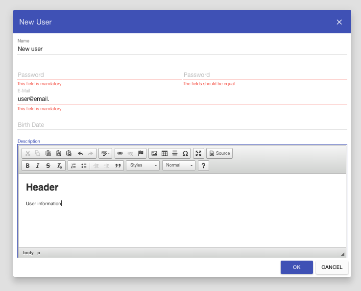

# AngularJS+Angular.Material web forms and dialogs
  
If you don't want to worry about any HTML markup but want to edit your existing model then this framework is for you.
Just define your model - fields and their types, and get Angular.Material-powered dialogs and web forms ready to edit your models.

It is easy to notice that examples contain only bootstrap HTML markup like script and CSS references.
 
# Usage example

Suppose we have the following model:

```json
{
  "title": "New User",
  "fields": {
    "id": {
      "title": "id",
      "type": "number",
      "visible": false
    },
    "name": {
      "title": "Name",
      "type": "text",
      "required": true
    },
    "password": {
      "title": "Password",
      "type": "password",
      "repeat": true,
      "required": true
    },
    "email": {
      "title": "E-Mail",
      "type": "email",
      "required": true
    },
    "birthday": {
      "title": "Birth Date",
      "type": "date"
    },
    "description": {
      "title": "Description",
      "type": "rich_text"
    }
  }
}
```

Then we get the following dialog almost for free:


